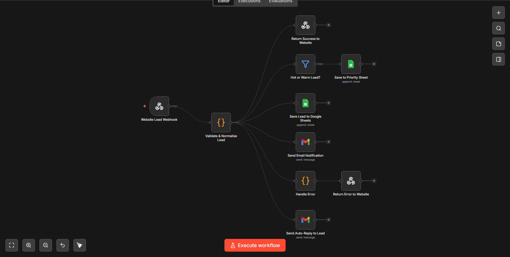

# 🧲 Lead Generation Workflow — n8n

An automated lead capture and qualification pipeline built with **n8n**. When a visitor submits a contact form on your website, this workflow validates the lead, scores it, stores it in Google Sheets, notifies you by email, and sends an instant auto-reply to the lead — all in seconds.

---

## 📸 Workflow Overview



---

## ⚙️ How It Works

### 1. `Website Lead Webhook`
- **Type:** Webhook (POST)
- **Endpoint:** `/capture-lead`
- Listens for form submissions from your website with CORS enabled (`allowedOrigins: *`).

---

### 2. `Validate & Normalise Lead`
- **Type:** Code (JavaScript)
- Extracts and normalises common field names (`name`, `fullName`, `full_name`, etc.) from the incoming payload.
- **Validation rules:**
  - Rejects submissions with no email or no name.
  - Validates email format via regex.
- **Lead Scoring (0–100):**

| Criteria | Points |
|---|---|
| Base score | +30 |
| Business email (non-free domain) | +20 |
| Phone number provided | +15 |
| Company name provided | +15 |
| Message longer than 60 characters | +10 |
| Urgent keywords in message/subject | +10 |

- **Lead Grade:**
  - 🔥 **Hot** — Score ≥ 75
  - ⚡ **Warm** — Score ≥ 50
  - 📩 **Cold** — Score < 50

---

### 3. `Return Success to Website`
- **Type:** Respond to Webhook
- Returns HTTP `200` with a personalised JSON response:
```json
{
  "success": true,
  "message": "Thank you <name>, we'll be in touch within 24 hours!",
  "leadId": "LEAD-<timestamp>"
}
```

---

### 4. `Hot or Warm Lead?`
- **Type:** Filter
- Passes the lead through only if the grade is **not** `Cold`.
- Hot/Warm leads are saved to a dedicated priority sheet.

---

### 5. `Save Lead to Google Sheets`
- **Type:** Google Sheets (append)
- Saves **all** leads to the **`Leads`** sheet in your Google Spreadsheet.
- Sheet ID: `YOUR_GOOGLE_SHEET_ID` ← replace this before deploying.

---

### 6. `Save to Priority Sheet`
- **Type:** Google Sheets (append)
- Saves only **Hot & Warm** leads to a separate **`Hot & Warm Leads`** sheet.

---

### 7. `Send Email Notification`
- **Type:** Gmail
- Sends a rich HTML email to **you** (the business owner) with:
  - Lead grade badge and score bar.
  - All captured lead fields (name, email, phone, company, subject, message, source).
  - One-click **Reply** CTA button.
  - Subject line dynamically reflects the grade: `🔥 HOT LEAD`, `⚡ New Lead`, or `📩 New Lead`.

---

### 8. `Send Auto-Reply to Lead`
- **Type:** Gmail
- Sends an instant HTML confirmation email **to the lead** with:
  - Their enquiry summary.
  - A 3-step "what happens next" timeline.
  - WhatsApp CTA for faster contact.

---

### 9. `Handle Error`
- **Type:** Code (JavaScript)
- Catches validation errors from step 2 and formats a clean error payload.

---

### 10. `Return Error to Website`
- **Type:** Respond to Webhook
- Returns HTTP `400` with an error message if the submission was invalid:
```json
{
  "success": false,
  "message": "Invalid submission. Please check your details and try again."
}
```

---

## 🔀 Workflow Connections

```
Website Lead Webhook
        │
        ▼
Validate & Normalise Lead
        │
        ├──▶ Return Success to Website
        ├──▶ Save Lead to Google Sheets
        ├──▶ Hot or Warm Lead? ──▶ Save to Priority Sheet
        ├──▶ Send Email Notification
        ├──▶ Send Auto-Reply to Lead
        └──▶ Handle Error ──▶ Return Error to Website
```

---

## 🛠️ Setup Instructions

### Prerequisites
- [n8n](https://n8n.io/) instance (self-hosted or cloud)
- Google account with Sheets & Gmail API access
- A website contact form that can POST to a webhook URL

### Steps

1. **Import the workflow**
   - In n8n, go to **Workflows → Import from File**
   - Upload `Lead_Generate_Workflow.json`

2. **Configure Google Sheets**
   - Replace `YOUR_GOOGLE_SHEET_ID` in both Google Sheets nodes with your actual spreadsheet ID.
   - Ensure your Google Sheets spreadsheet has two sheets named:
     - `Leads`
     - `Hot & Warm Leads`
   - Connect your Google account credentials in n8n.

3. **Configure Gmail**
   - In `Send Email Notification`, update `sendTo` to your own email address.
   - In `Send Auto-Reply to Lead`, update the footer name, email, and WhatsApp link.
   - Connect your Gmail credentials in n8n.

4. **Point your contact form to the webhook URL**
   - Activate the workflow and copy the webhook URL.
   - Set your form's `action` or `fetch` endpoint to:
     ```
     POST https://<your-n8n-domain>/webhook/capture-lead
     ```

5. **Activate the workflow**
   - Toggle the workflow to **Active** in n8n.

---

## 📦 Expected Payload

Your website form should POST a JSON body with any of these fields:

```json
{
  "name": "John Doe",
  "email": "john@company.com",
  "phone": "+91 9876543210",
  "company": "Acme Corp",
  "subject": "Request for demo",
  "message": "We need an urgent quote for your automation services.",
  "source": "Contact Page",
  "page": "https://yoursite.com/contact"
}
```

> Field names are flexible — the workflow also accepts `fullName`, `emailAddress`, `phoneNumber`, `companyName`, `projectType`, `description`, `utm_source`, `referrer`, etc.

---

## 📊 Lead Scoring Reference

| Grade | Score Range | Saved To |
|---|---|---|
| 🔥 Hot | 75–100 | All Leads + Priority Sheet |
| ⚡ Warm | 50–74 | All Leads + Priority Sheet |
| 📩 Cold | 0–49 | All Leads only |

---

## 📁 File Structure

```
Lead_Generate_Workflow.json   ← Import this into n8n
README.md                     ← This file
workflow_diagram.png          ← Visual workflow diagram
```

---

## 🧑‍💻 Built With

- [n8n](https://n8n.io/) — Workflow automation
- Google Sheets — Lead storage
- Gmail — Email notifications
- JavaScript — Lead validation & scoring logic

---

## 📄 License

This workflow is provided as-is for personal and commercial use. Modify freely to suit your needs.
